# ASFRV32IM-super
ASFRV32IM-super is collection of Single Cycle (not pipelined) In-order SuperScalar 
RISC-V RV32IM implementations.

ASFRV32IM-super has 12 different SuperScalar approach implemantations. 

ASFRV32IM-super is compliant with [RISC-V Unpriviledged ISA 20191213](https://riscv.org//wp-content/uploads/2019/12/riscv-spec-20191213.pdf).

ASFRV32IM-super has simple character output function (UART) and program cycle counter
with memory mapped IO, passes on all RV32IM riscv-tests(rv32ui-p and rv32um-p), and runs coremark and dhrystone benchmark.

ASFRV32IM-super is based on [ASFRV32IM](https://github.com/asfdrwe/ASFRV32IM). 

[ASFRV32IM-super2](https://github.com/asfdrwe/ASFRV32IM-super2) 
is another collection of Single Cycle (not pipelined) In-order SuperScalar RISC-V RV32IM implementations with more support of Macro Op Fusion.

## Implementation List
- Scalar (Reference)(1)
	- RV32IM-1 (Decoder + EXEC(ALU&BRANCH) in one same module outside of main RV32IM module)
- 2-way SuperScalar(7)
	- RV32IM-2 (single mul/div calculator and single load/store unit, not superscalared when Data hazards or Structural hazards or Control hazards)
	- RV32IM-2mul (added second mul/div calculator to RV32IM-2.v for Structural hazards)
	- RV32IM-2mem (added second load/store unit to RV32IM-2.v for Structural hazards)
	- RV32IM-2mem2 (added second load/store unit and store buffer for sw&lwcombination to RV32IM-2.v for Structural hazards)
	- RV32IM-2bp (added speculative execution to RV32IM-2.v for Control hazards)
	- RV32IM-2mof (added Macro Op Fusion(4 idioms: slli+add, add+load, lui+addi, auipc+load) to RV32IM-2.v for Data hazards)
	- RV32IM-2all (added second mul/div & load/store unit & store buffer & speculative exectuion & Macro Op Fusion for Data hazards and Structural hazards and Control hazards)
- 3-way SuperScalar(5)
	- RV32IM-3 (which has single mul/div calculator and single load/store unit. It is not superscalared when Data hazards or Structural hazards or Control hazards)
	- RV32IM-3mul (added second/third mul/div calculator to RV32IM-3.v for Structural hazards)
	- RV32IM-3mem (added second/third load/store unit to RV32IM-3.v for Structural hazards)
	- RV32IM-3bp (added speculative execution to RV32IM-3.v for Control hazards)
	- RV32IM-3all (added second/third mul/div & load/store unit & speculative exectuion & Macro Op Fusion for Data hazards and Structural hazards and Control hazards)

## LICENSE
  ```
Copyright (c) 2020 2021 asfdrwe <asfdrwe@gmail.com>

Permission is hereby granted, free of charge, to any person obtaining a copy 
of this software and associated documentation files (the "Software"), to deal 
in the Software without restriction, including without limitation the rights 
to use, copy, modify, merge, publish, distribute, sublicense, and/or sell 
copies of the Software, and to permit persons to whom the Software is 
furnished to do so, subject to the following conditions:

The above copyright notice and this permission notice shall be included in 
all copies or substantial portions of the Software.

THE SOFTWARE IS PROVIDED "AS IS", WITHOUT WARRANTY OF ANY KIND, EXPRESS OR 
IMPLIED, INCLUDING BUT NOT LIMITED TO THE WARRANTIES OF MERCHANTABILITY, 
FITNESS FOR A PARTICULAR PURPOSE AND NONINFRINGEMENT. IN NO EVENT SHALL 
THE AUTHORS OR COPYRIGHT HOLDERS BE LIABLE FOR ANY CLAIM, DAMAGES OR OTHER 
LIABILITY, WHETHER IN AN ACTION OF CONTRACT, TORT OR OTHERWISE, ARISING FROM, 
OUT OF OR IN CONNECTION WITH THE SOFTWARE OR THE USE OR OTHER DEALINGS 
IN THE SOFTWARE.
  ```

## Changelog
- 20210403
initial release

## Require
- [Icarus Verlog](http://iverilog.icarus.com/)
	- [Windows version](http://bleyer.org/icarus/)
- [gtkwave](http://gtkwave.sourceforge.net/) (optional)

I checked on Linux only.

## Getting started
```
$ git clone https://github.com/asfdrwe/ASFRV32IM-super.git
```

## Synthesis
for  RV32IM-1
```
$ cd RV32IM-1
$ make all
```
  
## Run
for RV32IM-1
```
$ cd RV32IM-1
```
### as cpu dump mode
  ```
$ ./RV32IM-1
  ```
### as uart mode
  ```
$ ./RV32IM-1_uart
  ```
### as benchmark mode
  ```
$ ./RV32IM-1_coremark
  ```

## How to write a program for ASFRV32IM-super (test.hex)
ASFRV32IM-super has 64KB memory(instruction and data).
ASFRV32IM-super runs test.hex which has the opcodes as an 8bit hexadecimal value in each lines, 
so you need risc-v binary to 8bit hexadecimal values.


### Hand assemble for first type
Example "lui x1, 0x20000"
  ```
0b_0010_0000_0000_0000_0000_00001_0110111 (binary)
0x_20_00_00_B7 (hexadecimal)
  ```
Write test.hex as
  ```
B7
00
00
20
  ```
(little endian)

### GCC
You use [RISC-V toolchain](https://github.com/riscv/riscv-gnu-toolchain) .

RETRIEVAL
  ```
$ git clone https://github.com/riscv/riscv-gnu-toolchain
$ cd riscv-gnu-toolchain
$ git submodule update --init --recursive
  ```

BUILD
  ```
$ ./configure --prefix=/opt/riscv
$ make linux
$ export PATH=/opt/riscv/bin:$PATH
  ```

ASFRV32IM is a baremetal.
So you need a linker script such as link.ld because ASFRV32IM's program starts from 0 address. 

[link.ld](mytest/link.ld)
  ```
OUTPUT_ARCH( "riscv" )
ENTRY(_start)

SECTIONS
{
  . = 0x00000000;
  .text : { *(.text) }
  . = ALIGN(0x0100);
  .sbss : { *(.sbss) }
  .bss : { *(.bss) }
  .sdata : { *(.sdata) }
  .data : { *(.data) }
  _end = .;
}
  ```

#### Assembly example
[test1.S](mytest/test1.S)    
  ```
.globl _start

_start:
  li x1, 38233200
  li x2, 3200
  mul  x3, x1, x2
  mulh  x3, x1, x2
_loop:
  jal x0, _loop
  ```

Assemble
  ```
$ riscv64-unknown-elf-gcc -o test1.bin test1.S -march=rv32g -mabi=ilp32 -nostdlib -nostartfiles -T ./link.ld
  ```

You need to convert binary to hex text.
You use objcopy command and [freedom-bin2hex.py](https://github.com/sifive/elf2hex/blob/master/freedom-bin2hex.py) (require python).

  ```
$ riscv64-unknown-elf-objcopy -O binary test1 test1.bin
$ python freedom-bin2hex.py -w 8 test1.bin test.hex
  ```

Run
  ```
$ cd (RV32IM-1 dir)
$ ./RV32IM-1
  ```

#### C example 1
You can't use int main() or stdio.h's printf function etc and you set 
stack pointer, so you use the startup routing such as start.S and 
use void \_main() for the main routine instead of int main().

[start.S](mytest/start.S)  
  ```
.globl _start

_start:
  li sp, 0xff00
  jal _main
_loop:
  jal _loop
  ```

[test2.c](mytest/test2.c)
  ```
void _main()
{
  static int a, b, c;
  a = 1;
  b = 2;
  c = 1 + 2;
  int d, e, f, h;
  d = 10;
  e = 15;
  f = e - d;
  h = a - 10;
  return;
}
  ```

Compile
  ```
$ riscv64-unknown-elf-gcc -o test2.bin start.S test2.c -march=rv32g -mabi=ilp32 -nostdlib -nostartfiles -T ./link.ld
  ```

Convert to hexadecimal text
  ```
$ riscv64-unknown-elf-objcopy test2 -O binary test2.bin
$ python freedom-bin2hex.py -w 8 test2.bin test.hex
  ```

Run
  ```
$ cd (RV32IM-1 dir)
$ ./RV32IM-1
  ```

#### C example 2
ASFRV32IM has UART output and program cycle counter with memory mapped IO.
You write 1 byte character such as 'a' to 0xfff0, and ASFRV32IM prints 'a'.
You read 4 byte read to 0xfff4, and you get ASFRV32IM's instruction count
from the pragram starting.

I build simple library 'libeelib' with ee\_lib.h.
You use libeelib to write program on ASFRV32IM.
Libeelib has barebones\_clock(retrive cycle count), 
uart\_send\_char(print 1 character like getchar), 
debug\_printf(print a string like printf), 
and strnlen, strlen, strcmp and strcpy.

Libeelib mainly comes from coremark's barebones code. 

[uart\_c.c](mytest/uart_c.c)
  ```
#include "ee_lib.h"

void _main()
{
  uart_send_char('A');
  uart_send_char('\n');
  debug_printf("test\n");
  debug_printf("%d\n", barebones_clock());
  debug_printf("test2\n");
  debug_printf("%d\n", barebones_clock());

  return;
}
  ```

Compile libeelib.a
  ```
$ riscv64-unknown-elf-gcc -c ee_lib.c -O2 -fno-builtin -march=rv32g -mabi=ilp32 -nostdlib -nostartfiles
$ ar rcs libeelib.a ee_lib.o
  ```
Compile uart\_c
  ```
$ riscv64-unknown-elf-gcc -O2 -o uart_c -fno-builtin -march=rv32g -mabi=ilp32 -nostdlib -nostartfiles -T link.ld start.S uart_c.c libeelib.a
  ```

Convert to hexadecimal text
  ```
$ riscv64-unknown-elf-objcopy uart_c -O binary uart_c.bin
$ python freedom-bin2hex.py -w 8 uart_c.bin test.hex
  ```

Run
  ```
$ cd (RV32IM-1 dir)
$ ./RV32IM-1_uart
  ```

Other sample programs are [mytest](mytest/) .

Macro Op Fusion test programs are moptest.S(slli+add, lui+lw, lui+addi, auipc+lw), moptest2.S(mulh+mul,mulhsu+mul,mulhu+mul), 
moptest3.S(div+rem,divu+remu), moptest4.S(lw+lw,sw+sw), moptest5.S(slli+add+lw), moptest6.S(lw+lw+lw,sw+sw+sw).

#### riscv-tests
[riscv-tests](https://github.com/riscv/riscv-tests) is a test program set for RISC-V CPU.

  ```
$ git clone https://github.com/riscv/riscv-tests
$ cd riscv-tests
$ git submodule update --init --recursive
$ autoconf
  ```

You need [riscv-tests_auto.patch](riscv-tests_auto.patch) for 0 address startup and removal of CSR code, and the test code outputs P when passed or the test code output F when failed.
(NOTE: ASFRV32IM's ecall acts as jump instruction to 0 address).

```
$ patch -p1 < (ASFRV32IM-super dir)/riscv-tests.patch
  ```

- \*.hex in [autotest](autotest/) are precompiled and hex format converted riscv-tests for ASFRV32IM.
- \*.dump in [autotest](autotest/) are deassembled riscv-tests programs.

BUILD
```
$ ./configure
$ make
```

The test programs are under isa/.

CONVERT rv32ui-p-xxx and rv32um-p-xxx to \*.hex
```
$ mkdir ../autotest
$ cp (from freedom-bin2hex path)/freedom-bin2hex.py ../autotest
$ cd isa
$ cp -a rv32ui-p-* rv32um-p-* ../../autotest/
$ cd ../../autotest
$ for i in *; do riscv64-unknown-elf-objcopy $i -O binary $i.bin ; python freedo
m-bin2hex.py -w 8 $i.bin $i.hex ; done
```

RUN riscv-tests 
for RV32IM-1
```
$ cd (RV32IM-1 dir)
$ for i in ../autotest/*.hex; do \cp -f "$i" test.hex; echo "$i" ; ./RV32IM-1_uart ; done
```

#### COREMARK
[Coremark](https://github.com/eembc/coremark) is a CPU benchmark mainly 
for an embedded system and runs on baremetal environment. 

You need [coremark.patch](coremark.patch) for 0 address startup, uart and cycle count for ASFRV32IM-super's memory mapped IO.

ASFRV32IM-super runs only 10 iterations.

  ```
$ git clone https://github.com/eembc/coremark.git
$ cd coremark
$ patch -p1 < ../coremark.patch
$ make PORT_DIR=barebones ITERATIONS=10
$ riscv64-unknown-elf-objcopy -O binary coremark.bin tmp.bin
$ python ../freedom-bin2hex.py -w 8 tmp.bin coremark.hex
$ cp coremark.hex ../test.hex
  ```

Run
  ```
$ ./RV32IM-1_coremark
  ```

#### DHRYSTONE
[dhrystone](https://github.com/riscv/riscv-tests/tree/master/benchmarks/dhrystone) is a CPU benchmark. 

You need [dhrystone.patch](dhrystone.patch) for 0 address startup, uart, cycle counter and some fixes for ASFRV32IM-super.

  ```
$ cp -a (riscv-tests dir)/benchmark/dhrystone dhrystone
$ cd dhrystone
$ patch -p1 < ../dhrystone.patch
$ make
$ riscv64-unknown-elf-objcopy -O binary dhrystone dhrystone.bin
$ python ../freedom-bin2hex.py -w 8 dhrystone.bin dhrystone.hex
$ cp dhrystone.hex ../test.hex
  ```

Run
  ```
$ ./RV32IM-1_coremark
  ```

#### Coremark & Dhrystone RESULT on ASFRV32IM-super and ASFRV32IM-super2

|IMPLEMENTATION|COREMARK(s)|COREMARK/MHz|RATIO|DHRYSTONE|DMIPS|RATIO|
---------------|-----------|------------|-----|---------|-----|-----
|RV32IM-1|3083|3.24|100%|1844|1.05|100%|
---------------|-----------|------------|-----|---------|-----|-----
|RV32IM-2|2050|4.88|151%|2739|1.56|149%|
|RV32IM-2mul|1986|5.04|156%|2739|1.56|149%|
|RV32IM-2mem|1949|5.13|158%|2923|1.66|158%|
|RV32IM-2mem2|1945|5.14|159%|2941|1.67|159%|
|RV32IM-2bp|2002|5.00|154%|2762|1.57|150%|
|RV32IM-2mof|2050|4.88|151%|2747|1.56|149%|
|RV32IM-2all|1829|5.47|169%|3194|1.82|173%|
---------------|-----------|------------|-----|---------|-----|-----
|RV32IM-3|1839|5.44|168%|3344|1.90|181%|
|RV32IM-3mul|1839|5.44|168%|3355|1.91|182%|
|RV32IM-3mem|1798|5.56|172%|3731|2.12|202%|
|RV32IM-3bp|1733|5.77|178%|3412|1.94|185%|
|RV32IM-3all|1544|6.48|200%|3831|2.18|208%|
---------------|-----------|------------|-----|---------|-----|-----
|RV32IM-1new|3083|3.24|100%|1844|1.05|100%|
|RV32IM-2new-notopt|2050|4.88|151%|2739|1.56|149%|
|RV32IM-2new|1995|5.01|155%|2808|1.60|152%|
|RV32IM-3new-notopt|1839|5.44|168%|3344|1.90|181%|
|RV32IM-3new|1727|5.79|179%|3521|2.00|190%|
|RV32IM-3new2|1725|5.80|179%|3571|2.03|193%|

## ASFRV32IM-super Design
- RV32IM-1
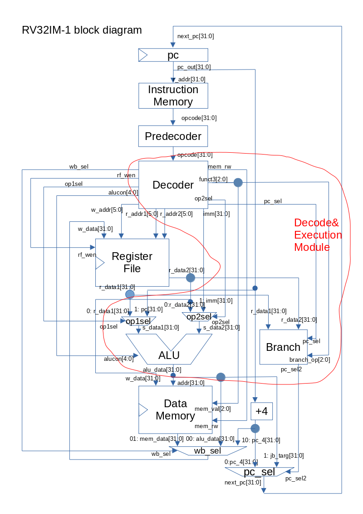

- RV32IM-2
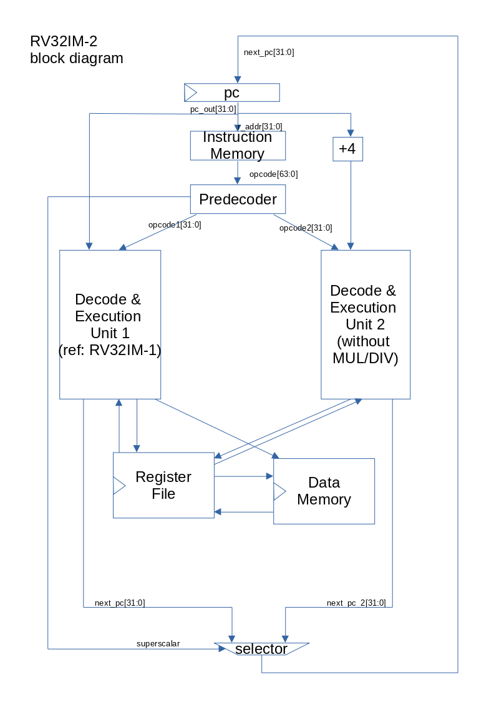
- RV32IM-2mul
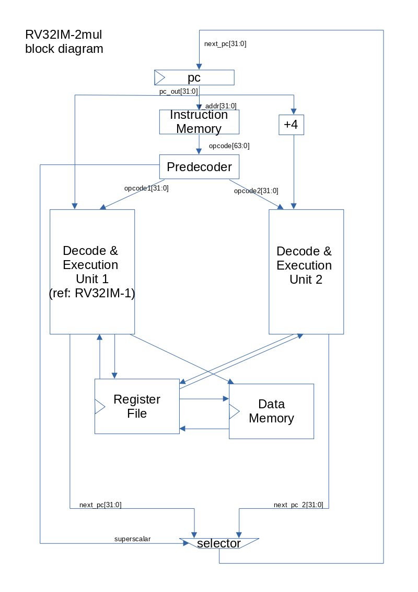
- RV32IM-2mem
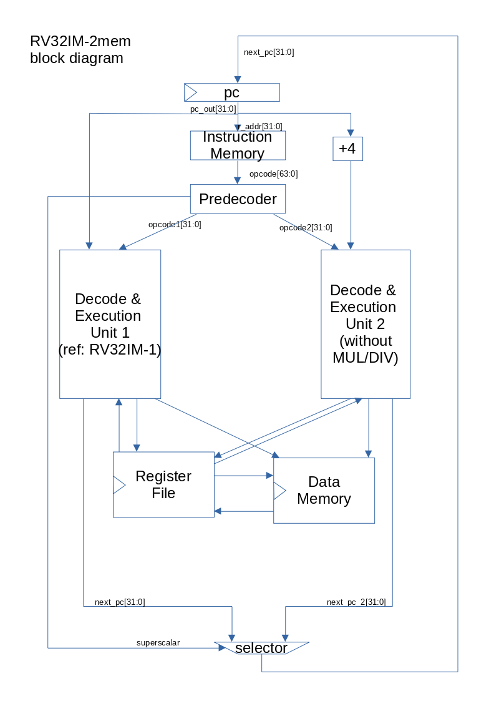
- RV32IM-2mem2
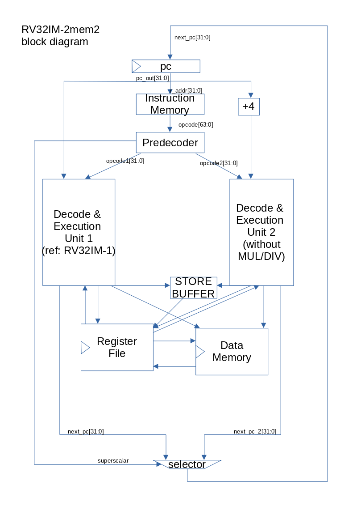
- RV32IM-2bp
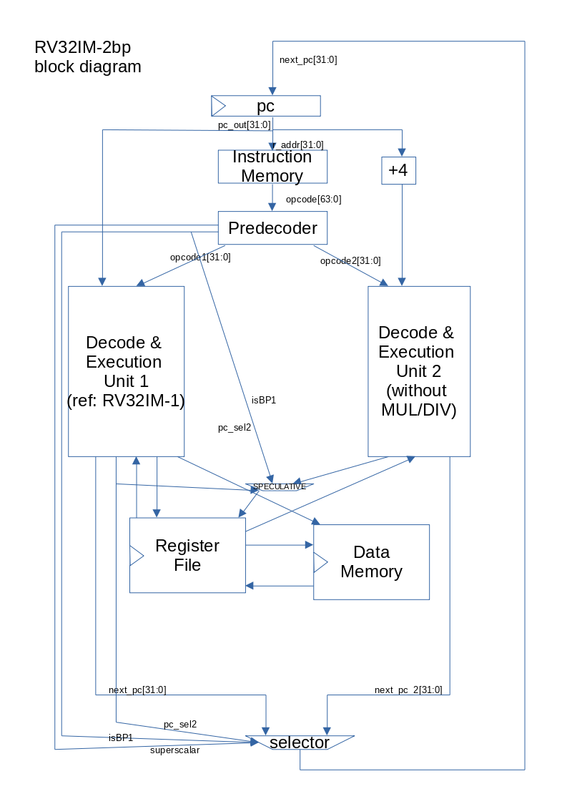
- RV32IM-2mof
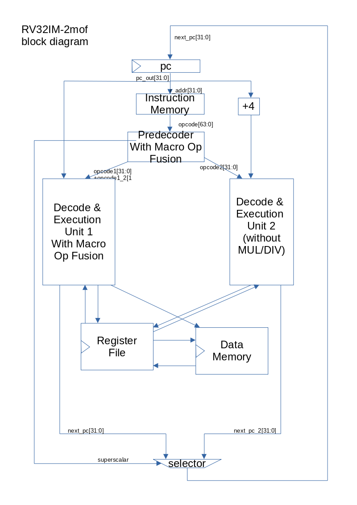
- RV32IM-2all
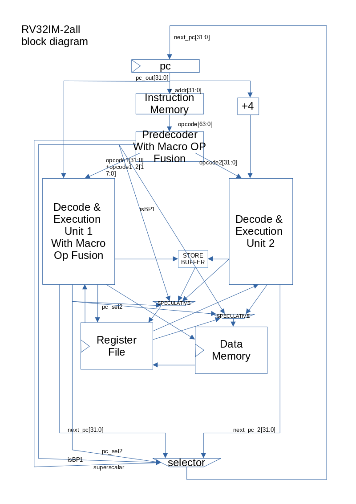

- RV32IM-3
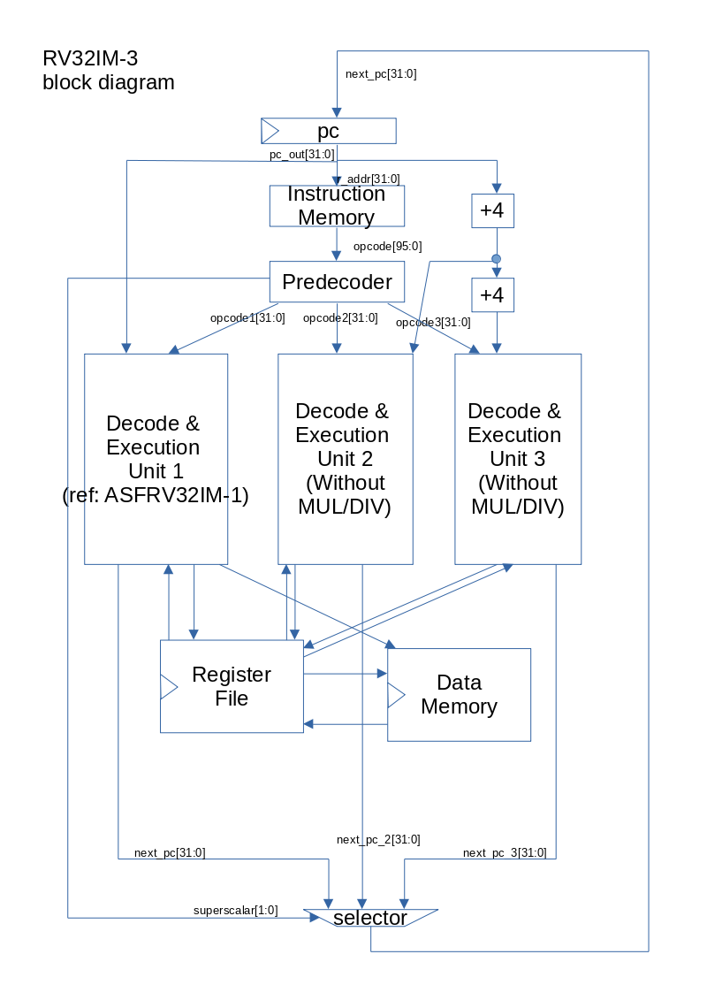
- RV32IM-3mul
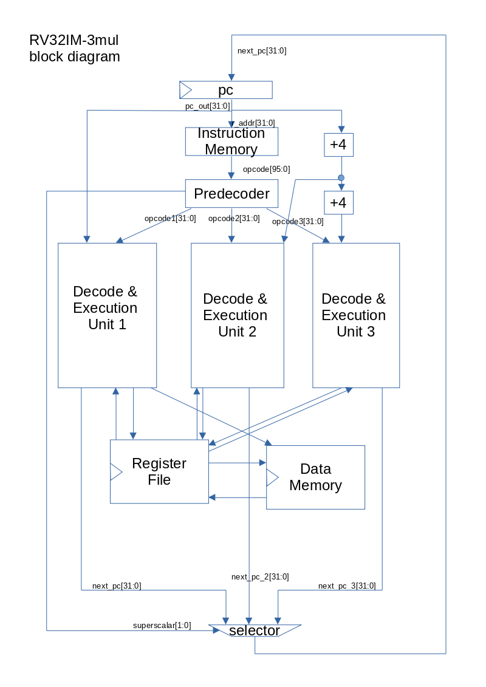
- RV32IM-3mem
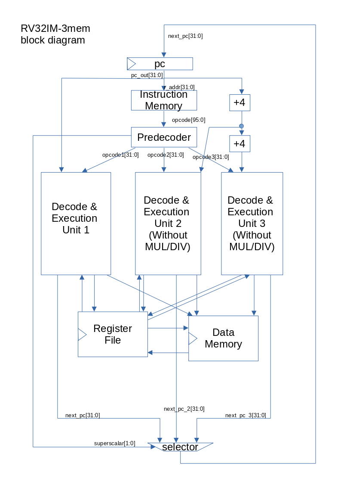
- RV32IM-3bp
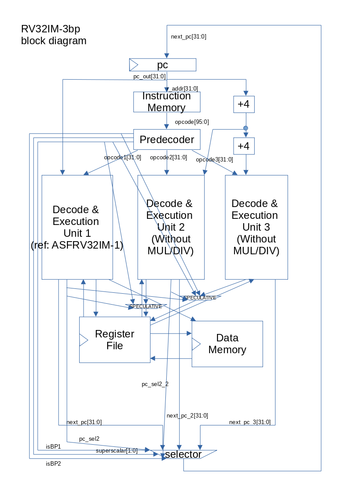
- RV32IM-3all
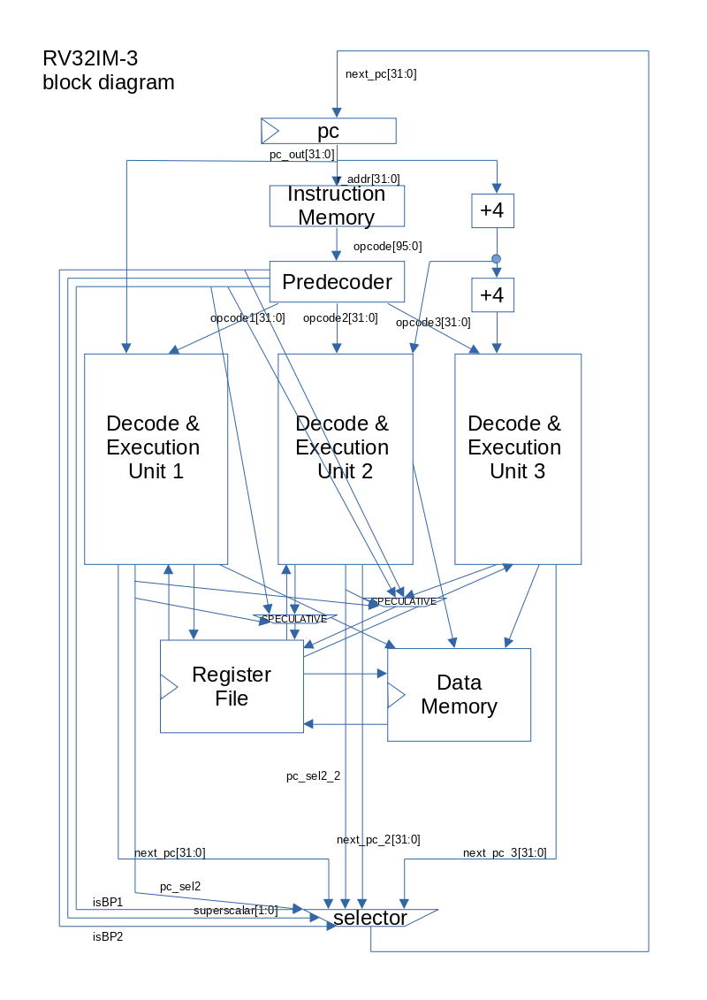

## Reference 
- [RISC-V specification](https://riscv.org/technical/specifications/)
- [RISC-V Macro-Op fusion paper](https://people.eecs.berkeley.edu/~krste/papers/EECS-2016-130.pdf)
